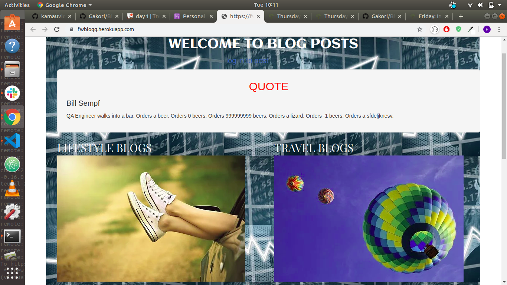

## TITLE
 BLOG

## AUTHOR
 Built By Faith Gakori

## PROJECT DESCRIPTION

Blog is an application that enables users to view different types of blogs depending on ones interest.The application also give a chance to the users to post their on blogs,comment on other peoples blog, delete blogs they didnt like and also view different quotes in the same application.

## SCREENSHOTS

## USER STORIES

* As a user, I would like to view the blog posts on the site
* As a user, I would like to comment on blog posts
* As a user, I would like to view the most recent posts
* As a user, I would like to an email alert when a new post is made by joining a subscription.
* As a user, I would like to see random quotes on the site
* As a writer, I would like to sign in to the blog.
* As a writer, I would also like to create a blog from the application.
* As a writer, I would like to delete comments that I find insulting or degrading.
* As a writer, I would like to update or delete blogs I have created.

## Prerequisities

* Flask
* Pip
* Python

## SetUp / Installation Requirements

* python3.6
* pip

## Cloning
In your terminal:
* $ git clone https://github.com/gakori/Blogg.git
* $ cd Blogg

## Running the Application
To run the application, in your terminal:
* (virtual)$ chmod a+x start.sh
* $ ./start.sh

## TECHNOLOGIES USED
* Python3.6
* bootstrap
* flask
* css

## CONTACT INFORMATION
 For email reach us through faithgakori506@gmail.com

## LICENCE
MIT ©2019 Faith Gakori